# Exercice 1
## Résumé
Objectif : le but de cet exercice est de se familiariser avec Azure et le déploiement de ressources dans Azure avec le portail Azure dans un premier temps puis au travers du déploiement via Az Cli et Azure Resource Manager (ARM).

Tâches : 
 - [Etape 1 : créer une webapp au travers du portail Azure](.#etape-1---cr%C3%A9er-une-webapp-via-le-portail-azure)
 - [Etape 2 : ajouter un storage account à votre déploiement via Azure Cli](.#etape-2---cr%C3%A9er-un-storage-account-en-utilisant-az-cli)
 - [Etape 2 : ajouter un storage account à votre déploiement via la cmdlet Powershell ARM](.#etape-3---cr%C3%A9er-un-storage-account-en-utilisant-la-cmdlet-powerhsell-arm)
 - [Etape 4 : ajouter une base de données Azure SQL DB via Azure ARM](.#etape-4---cr%C3%A9er-une-base-de-donn%C3%A9es-azure-sql-db-en-utilisant-un-template-arm)

## Etape 1 - Créer une WebApp via le portail Azure
Se connecter au portail Azure : https://portal.azure.com
Utiliser votre compte personnel disposant d'une souscription Azure

Dans le "burger menu", choisir "Create a resource"  
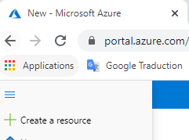

Puis chercher le terme "web app"  
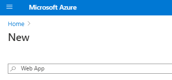

Appuyez vous sur le tableau ci-dessous pour le choix des propriétés de votre WebApp  
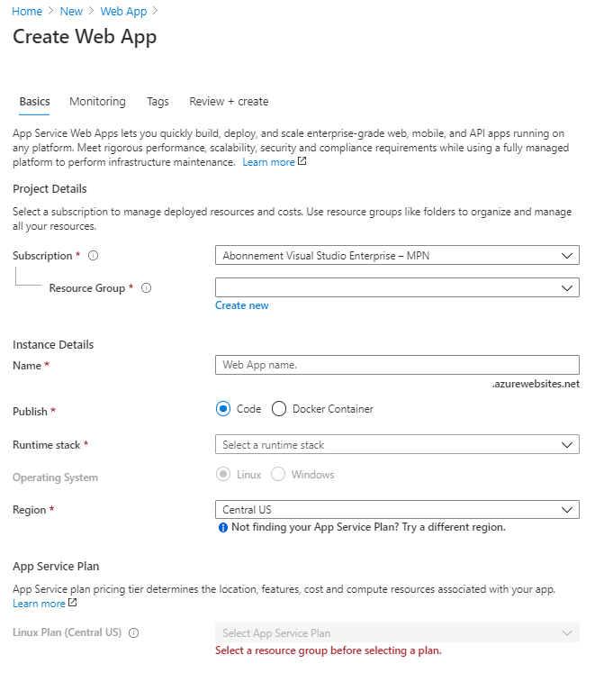

| Propriétés | Description | Valeur |
| --- | --- | --- |
| Subscription | Souscription sur laquelle sera créée la WebApp | Votre souscription
| Resource Group | Groupe de ressources dans lequel sera créé la WebApp | Cliquez sur "Create new" et choisir `dojoazure-us01-ex01` (us01 = votre id de user)
| Name | Votre nom de webapp | Choisir `webapp-us01-ex01` (us01 = votre id de user)
| Publish | Méthode de déploiement : Code = runtime pré-installé, Docker Container = image docker à fournir | Choisir `Code`
| Runtime stack | Runtime pré-installé | Choisir `ASP.NET V4.7`
| Operating system | OS sous-adjacent utilisé | Champ pré-selectionné par Azure
| Region | Région Azure d'hébergement | Choisir `France Central`

Pour la sous-section App Service Plan
| Propriétés | Description | Valeur |
| --- | --- | --- |
| Windows plan | App Service plan qui sera utilisé par votre WebApp | Cliquer sur "Create New"
| Name | Nom de votre ASP | Choisir `webapp-us01-ex01-asp` (us01 = votre id de user)
| Sku and size | Sizing de votre ASP (nombre et taille de machines/instances) | Choisir `Dev/Test - F1` (ASP Gratuit)

Une fois complété :  
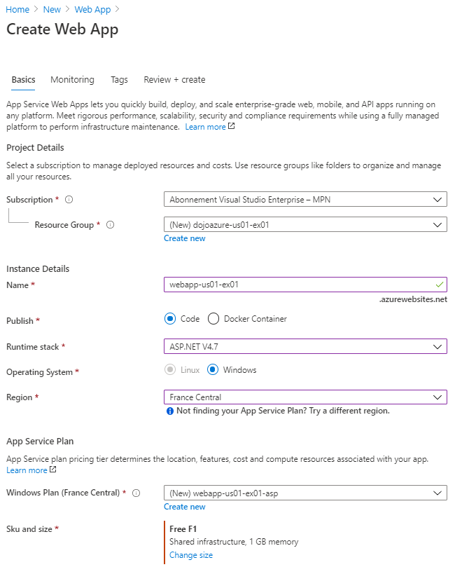

> 📘 Vous avez configurée votre WebApp avec son App Service Plan associé

Cliquez sur next pour passer à la partie "Monitoring" et configurer la section ainsi  
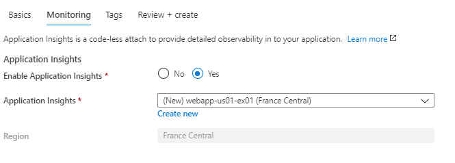

> 📘 Votre WebApp sera associée directement l'Application Insights renseigné pour son monitoring

Cliquez sur next pour passer à la partie "Tags" et configurer la section ainsi  
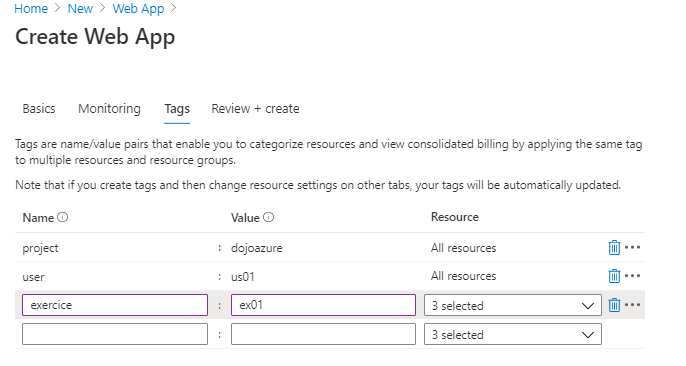

> 📘 Les tags utilisés peuvent être utiles pour différentes activités : management, FinOps, monitoring...

Cliquez sur "Review + create" puis "Create" une fois la validation Azure passée

Une fois le déploiement effectuée, allez sur votre Resource Group `dojoazure-usXX-ex01` et observez les resources créées : 
 - Votre WebApp `webapp-usXX-ex01` qui hébergera votre application
 - Votre WebApp `webapp-usXX-ex01-asp` qui définit la puissance allouée à votre webapp (nombre et tailles des machines/instances sous-adjacentes)
 - Votre Application Insights `webapp-usXX-ex01-ai` qui capturera automatiquement les données de monitoring de votre application
  
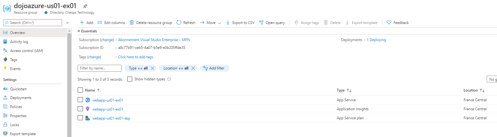

L'application web est consultable en allant sur le lien transmis dans les propriétées de votre WebApp :  
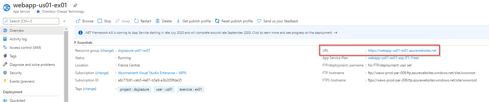
  
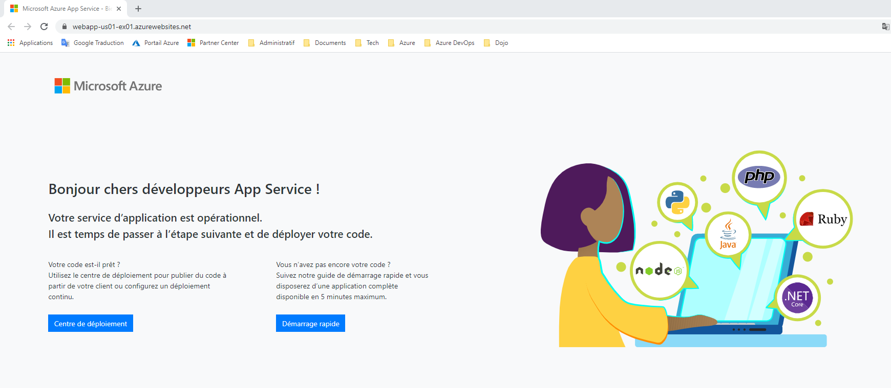
  
> 👏 Bravo, votre WebApp est déployée ! 

## Etape 2 - Créer un Storage Account en utilisant az cli
Dans cette étape, nous allons utiliser l'interface de ligne de commande Azure appelée az cli.
Elle peut être installée sur votre poste de travail en suivant [ce lien](https://docs.microsoft.com/fr-fr/cli/azure/install-azure-cli?view=azure-cli-latest) ou via l'option Cloud Shell du portail Azure, nous utiliserons cette méthode dans l'exercice suivant

Sur le portail Azure, lancer le Cloud Shell  
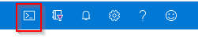  

Lors de sa première exécution, un popup va vous signaler que le Cloud Shell n'est pas configuré  
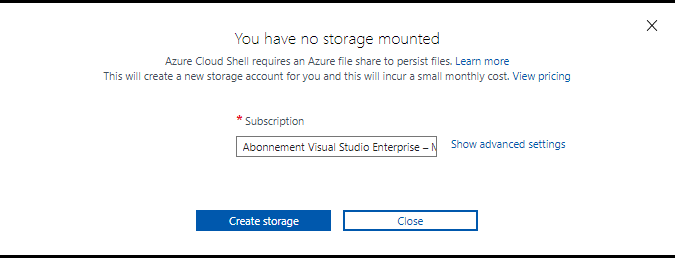  

Il faut donc le configurer. Pour cela, Azure va créer un Resource Group sur votre souscription avec un Storage Account qui servira à stocker le paramétrage du Cloud Shell. Si il n'y a pas de Cloud Shell existant pour votre souscription, merci de suivre les indications suivantes :
 - Cliquer sur advanced settings
 - Configurer les propriétés  
| Propriétés | Description | Valeur |
| --- | --- | --- |
| Cloud Shell region | Région d'hébergement | Choisir `France Central`
| Resource Group | Groupe de ressources pour votre Cloud Shell | Indiquer `cloudshell`
| Storage account | Utilisé pour sauvegarder les propriétés du CS | Indiquer `cloudshellsaXXXX` (XXXX = chaine de caractères aléatoire)*
| File share | File share qui sera utilisé pour sauvegarder votre espace CS dans le Storage Account | Choisir `cloudshellfs`
*un storage account doit avoir un nom unique dans une région donnée car cela réserve un alias DNS dans Azure qui doit être unique
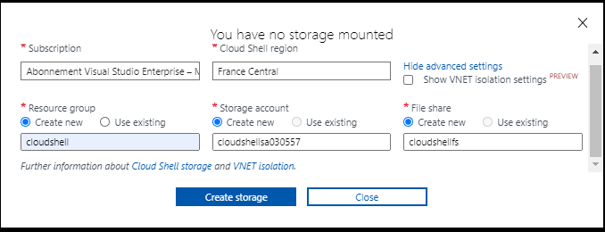
 - Cliquer sur "create storage"

Une fois le Cloud Shell démarré, vous avez le choix entre une interface bash ou Powershell. Choisissez celle qui vous plait le plus. Cela n'a pas d'incidence sur l'usage d'az cli. Ici l'interface PowerShell
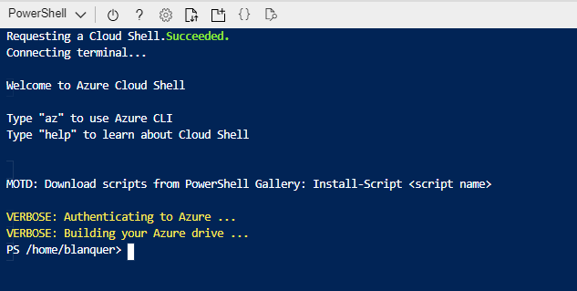  

> 👀 si vous utilisez az cli sur votre poste, bien vous authentifier sur Azure via la commande `az login` avant de suivre la suite de l'exercice

Configurer ensuite l'environnement de travail Azure à manipuler avec az cli :
 - Lister les souscriptions de votre abonnement : `az account show`
 - Choisir la souscriptions à manipuler : `az account set --subscription "XXXXX"` (où XXXXX = ID de votre souscription récupéré dans le résultat de la commande précédente)
  - A tout moment, pour une aide sur une commande `az XXX --help`(où XXX = commande sur laquelle obtenir de l'aide)

Ensuite, voici la commande à exécuter pour créer le Storage Account de cet exercice :  
`az storage account create --name dojoazureus01ex01 --resource-group dojoazure-us01-ex01 --location francecentral --https-only --kind StorageV2 --sku Standard_LRS --tags project=dojoazure exercice=ex01 user=us01`
  
Quelques explications :
| Propriétés | Description | Valeur |
| --- | --- | --- |
| --name | Nom du Storage Account à créer | Ici `dojoazureus01ex01` (attention, nom unique pour la région)
| --resource-group | Nom du RG dans lequel créer le Storage Account | Ici `dojoazure-us01-ex01` (idem à l'étape 1 de cet exercice)
| --location | Région du Storage Account | Ici `francecentral`
| --https-only | Paramètre qui précise que le Storage Account ne sera utilisable qu'en https | 
| --kind | Paramètre pour préciser le type de Storage Account | Ici `StorageV2` qui indique la V2
| --sku | Paramètre pour préciser le SKU du Storage Account | Ici `Standard_LRS` qui indique que le storage sera de type Standard et en LRS ([cf. SKU Storage Account](https://docs.microsoft.com/en-us/rest/api/storagerp/srp_sku_types))
| --tags | Tags associés au Storage Account | Ici `project=dojoazure exercice=ex01 user=us01` (idem aux tags utilisés pour la WebApp de l'étape 1)
  
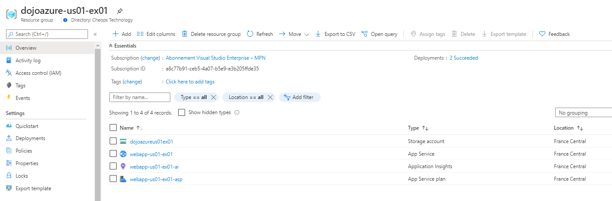  

> 👏 Bravo, votre Storage Account est créé via az cli !

## Etape 3 - Créer un Storage Account en utilisant la cmdlet Powerhsell ARM
A l'instar de l'étape précédente, nous allons utiliser le Cloud Shell pour utiliser la cmdlet Powershell ARM. C'est un module powershell qui permet de manipuler Azure via Azure Resource Manager

Sur le portail Azure, aller sur le Cloud Shell  

Une fois le Cloud Shell démarré, vous avez le choix entre une interface bash ou Powershell. Choisissez l'interface Powershell
  

> 👀 si vous utilisez le module Powershell sur votre poste, bien vous authentifier sur Azure via la commande `Login-AzAccount` avant de suivre la suite de l'exercice

Configurer ensuite l'environnement de travail Azure à manipuler avec az cli :
 - Lister les souscriptions de votre abonnement : `Get-AzSubscription`
 - Choisir la souscriptions à manipuler : `Select-AzSubscription -SubscriptionId "XXXXX"` (où XXXXX = ID de votre souscription récupéré dans le résultat de la commande précédente)
  - A tout moment, pour une aide sur une commande `Get-Help XXX`(où XXX = commande sur laquelle obtenir de l'aide)

Ensuite, voici la commande à exécuter pour créer le Storage Account de cet exercice :  
`New-AzStorageAccount -Name dojoazureus01ex01ps -ResourceGroupName dojoazure-us01-ex01 -Location francecentral -EnableHttpsTrafficOnly $true -Kind StorageV2 -sku Standard_LRS  -Tags @{project="dojoazure";exercice="ex01";user="us01"}`
  
Quelques explications :
| Propriétés | Description | Valeur |
| --- | --- | --- |
| -Name | Nom du Storage Account à créer | Ici `dojoazureus01ex01ps` (attention, nom unique pour la région)
| -ResourceGroupName | Nom du RG dans lequel créer le Storage Account | Ici `dojoazure-us01-ex01` (idem à l'étape 1 de cet exercice)
| -Location | Région du Storage Account | Ici `francecentral`
| -EnableHttpsTrafficOnly | Paramètre qui précise que le Storage Account ne sera utilisable qu'en https | ici boolean `$true`
| -Kind | Paramètre pour préciser le type de Storage Account | Ici `StorageV2` qui indique la V2
| -Sku | Paramètre pour préciser le SKU du Storage Account | Ici `Standard_LRS` qui indique que le storage sera de type Standard et en LRS ([cf. SKU Storage Account](https://docs.microsoft.com/en-us/rest/api/storagerp/srp_sku_types))
| -Tags | Tags associés au Storage Account | Ici `@{project="dojoazure";exercice="ex01";user="us01"}` (idem aux tags utilisés pour la WebApp de l'étape 1)
  
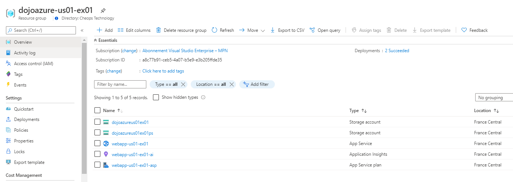  

> 👏 Bravo, votre Storage Account est créé via la cmdlet Powershel ARM !

## Etape 4 - Créer une base de données Azure SQL DB en utilisant un template ARM
Dans cette nouvelle étape, nous allons cette fois utiliser une méthode d'Infra As A Code qui permet de créer des ressources Azure en utilisant un langage descriptif s'appuyant sur les Templates ARM. Basé sur Azure Resource Manager, les templates ARM permettent de décrire l'infrastructure Azure souhaitée au format json puis lors de l'exécution, les API ARM Azure sont sollicités pour interprêter le template

Le fichier [azdeploy.json](./azdeploy.json) correspond à un template ARM qui permet de déployer les Etapes 1 à 3 de cet exercice.

Vous pouvez déployer ce template en allant sur le Cloud Shell (interface powerhshell) et en exécutant la commande suivante :  
`New-AzResourceGroupDeployment -Name deployARMTemplate -ResourceGroupName dojoazure-us01-ex01 -TemplateUri https://raw.githubusercontent.com/mblanquer/azure-automation/prepa_dojo/Exercice1/azuredeploy.json -TemplateParameterObject @{"user_id"="usXX"}`  
(où usXX = votre id user, par exemple "us01")
  
Quelques explications :
| Propriétés | Description |
| --- | --- | 
| New-AzResourceGroupDeployment | Commande Powershell pour le déploiement sur RG de templates ARM
| -Name | Nom du déploiement
| -ResourceGroupName | Nom du RG dans lequel créer le Storage Account
| -Location | Région du Storage Account
| -TemplateUri | Url du template ARM à exécuter
| -TemplateParameterObject | Passage des paramètres au template ARM sous forme d'objet

Les logs du déploiement de template ARM sont visibles dans l'écran "Deployments" du Resource Group concerné par le déploiement :  
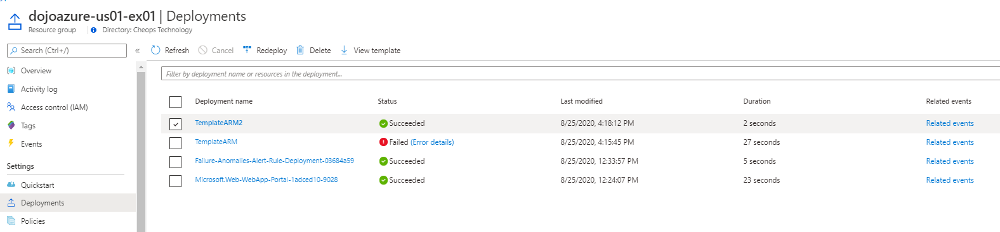  

Avant de poursuivre l'exercice, il convient de comprendre la structure d'un template ARM :  
{  
    "$schema": "https://schema.management.azure.com/schemas/2015-01-01/deploymentTemplate.json#",  
    "contentVersion": "1.0.0.0",  
    "parameters": {},  
    "variables": {},  
    "resources": [],  
    "outputs": {}  
}  
  
| Propriétés | Description |
| --- | --- |
| $schema | Lors de l'exécution du template, ce schéma sera utilisé pour vérifier que la syntaxe et les propriétés utilisées dans le json sont correctes
| contentVersion | Permet de versionner le template 
| parameters | Section qui permet de définir les paramètres attendus par le template. Dans ce template c'est le `user_id` qui permet d'identifier l'utilisateur. Cette valeur est ensuite utilisée pour définir un ensemble de noms utilisés sous forme de variables
| variables | Section qui permet de définir des variables utilisées dans le template. Dans ce template, les noms des différentes ressources sont définis sous forme de variables qui utilise le paramètre `user_id` pour l'unicité des noms
| resouces | Section qui permet de définir les ressources Azure à déployer. Il convient de renseigner le "provider" qui correspond au type de ressource mais aussi "l'api version" qui définit la version d'API ARM à utiliser
| outputs | Section qui permet de définir quels seront les outputs de ce template lors de son exécution

_Remarque_ : la doc des API ARM et des propriétés attendues par ressource est disponible [sur ce lien](https://docs.microsoft.com/en-us/azure/templates/microsoft.aad/allversions)
  
Quelques fonctions utilisées dans le template :
 - `[ResourceGroup().location]` : utilisé pour définir que la location d'une ressource hérite de la location du Resource Group dans lequel elle est déployée
 - `[concat()]` : permet de concatener des paramètres/variables/chaines de caractères
 - `[parameters('xxx')]`: permet de faire référence au paramètre xxx reçu en input du template
 - `[variables('xxx')]`: permet de faire référence à la variable xxx définie dans le template
 - `dependsOn`: permet de spécifier que le déploiement de la ressource concernée est dépendante du déploiement d'une autre resource Azure définie dans le template. Automatiquement, ARM va attendre que cette ressource soit déployée pour déployer la ressource définie. Dans le cas contraire, il parallélise le déploiement des deux ressources

 > 📘 Vous savez comment est structuré un template ARM et comment l'exécuter pour créer vos ressources dans Azure !

 Ajoutons maintenant la base de données à ce template :
  - Télécharger le fichier azdeploy.json et éditez le avec l'éditeur de votre choix. Si vous le souhaitez, vous pouvez utiliser l'éditeur situé dans le Cloud Shell Azure en appuyant sur le bouton suivant  une fois le CS démarré. vous pouvez même cloner le repo GitHub pour récupérer le fichier .json via la commande `git clone https://github.com/mblanquer/azure-automation.git`  
  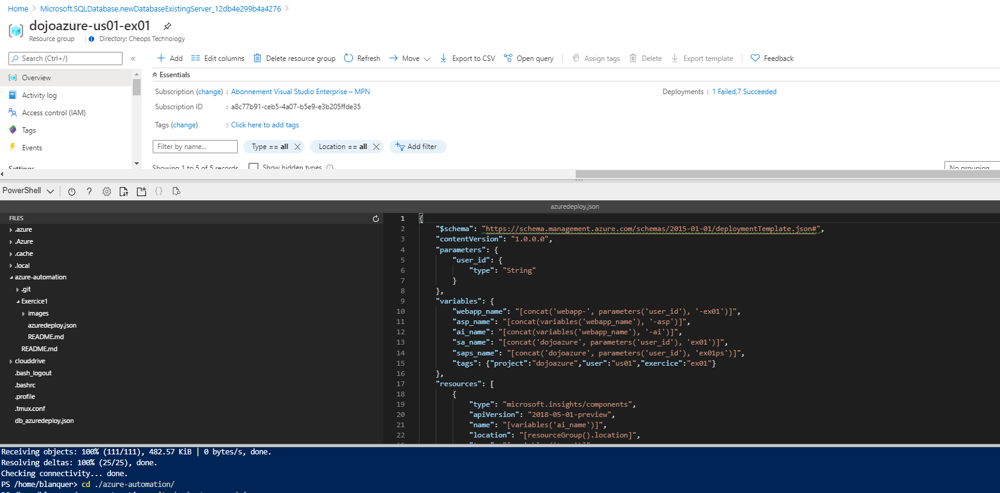  
  - Dans la section "parameters", ajouter le paramètre suivant qui sera utilisé pour créer un password unique pour le compte admin SQL :  
        `"date": {`  
            `"type": "String",`  
            `"defaultValue": "[utcNow()]"`  
        `}`  
  - Dans la section "variables", ajouter les deux variables suivantes qui correspondront aux noms de l'Azure SQL Server et à l'Azure SQL Database :  
        `"dbserver_name" : "[concat(parameters('user_id'), '-db')]",`
        `"db_name" : "[concat(parameters('user_id'), '-db')]"`  
  - Toujours dans la section "variables", ajouter la variable suivante qui créé un mot de passe unique pour le compte admin d'Azure SQL Server :
        `"administratorLoginPassword" : "[concat('db', uniqueString(concat(parameters('user_id'), variables('dbserver_name'), parameters('date'))),'!')]"`
  - Dans la sections "resources", ajouter ensuite le bloc suivant pour la création de l'Azure SQL Server :  
        `{`  
            `"type": "microsoft.sql/servers",`  
            `"apiVersion": "2019-06-01-preview",`  
            `"name": "[variables('dbserver_name')]",`  
            `"location": "[resourceGroup().location]",`  
            `"tags": "[variables('tags')]",`  
            `"properties": {`  
                `"administratorLogin": "adminDB",`  
                `"administratorLoginPassword": "[variables('administratorLoginPassword')]"`  
            `}`  
        `}`  
  - Dans la sections "resources", ajouter ensuite le bloc suivant pour la création de l'Azure SQL DB :
        `{`  
            `"type": "microsoft.sql/servers/databases",`  
            `"apiVersion": "2019-06-01-preview",`  
            `"name": "[concat(variables('dbserver_name'), '/', variables('db_name'))]",`  
            `"location": "[resourceGroup().location]",`  
            `"dependsOn": ["[variables('dbserver_name')]"],`  
            `"tags": "[variables('tags')]",`  
            `"sku": {`  
                `"name": "GP_S_Gen5",`  
                `"tier": "GeneralPurpose",`  
                `"family": "Gen5",`  
                `"capacity": 1`  
            `},`  
            `"kind": "v12.0,user,vcore,serverless",`  
            `"properties": {`  
                `"maxSizeBytes": 1073741824,`  
                `"autoPauseDelay": 60,`  
                `"minCapacity": 0.5`  
            `}`  
        `}`  

Rexécuter votre template :
 - Aller dans le cloud shell en interface PowerShell
 - Uploader votre template via le bouton 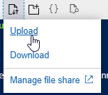  
 - Lancer la commande suivante :  
 `New-AzResourceGroupDeployment -Name deployARMTemplate -ResourceGroupName dojoazure-us01-ex01 -TemplateFile ./azuredeploy.json -TemplateParameterObject @{"user_id"="usXX"}`  
 (où usXX = votre id user, par exemple "us01")
 - Vous devriez voir votre Azure SQL DB et Azure SQL Server créé dans le Resource Group :
 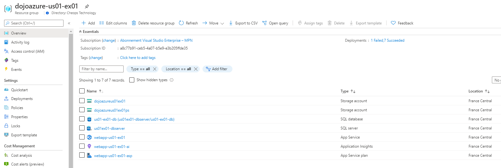 

Le template ARM correspondant aux ajouts effectués ci-dessous est [db_azdeploy.json](#./db_azdeploy.json)

> 👏 Bravo, votre database Azure SQL est créé via un template ARM !

----------------------------------------------------------------------------------------------------------------
Au travers de cet exercice, vous avez appris à :
 - vous familiarisez avec Azure
 - à manipuler des ressources Azure via le Portail Azure
 - à manipuler des ressources Azure via l'interface de commande az cli
 - à manipuler des ressources Azure via la cmdlet Powershell ARM
 - à manipuler des ressources Azure via un template ARM