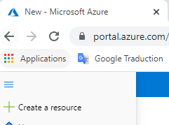

# Exercice 1
## Résumé
Objectif : le but de cet exercice est de se familiariser avec Azure et le déploiement de ressources dans Azure avec le portail Azure dans un premier temps puis au travers du déploiement via Az Cli et Azure Resource Manager (ARM).

Tâches : 
 - [Etape 1 : créer une webapp au travers du portail Azure](#etape1-cr%C3%A9er-une-webapp-via-le-portail-azure)
 - [Etape 2 : ajouter un storage account à votre déploiement via Azure Cli]()
 - [Etape 3 : ajouter une base de données Azure SQL DB via Azure ARM]()

## Etape 1 créer une webapp via le portail Azure
Se connecter au portail Azure : https://portal.azure.com
Utiliser votre compte personnel disposant d'une souscription Azure

Dans le "burger menu", choisir "Create a resource"  

Puis chercher le terme "web app"  

Appuyez vous sur le tableau ci-dessous pour le choix des propriétés de votre WebApp  

| Propriétés | Description | Valeur |
| --- | --- | --- |
| Subscription | Souscription sur laquelle sera créée la WebApp | Votre souscription
| Resource Group | Groupe de ressources dans lequel sera créé la WebApp | Cliquez sur "Create new" et choisir `dojoazure-us01-ex01` (us01 = votre id de user)
| Name | Votre nom de webapp | Choisir `webapp-us01-ex01` (us01 = votre id de user)
| Publish | Méthode de déploiement : Code = runtime pré-installé, Docker Container = image docker à fournir | Choisir `Code`
| Runtime stack | Runtime pré-installé | Choisir `ASP.NET V4.7`
| Operating system | OS sous-adjacent utilisé | Champ pré-selectionné par Azure
| Region | Région Azure d'hébergement | Choisir `France Central`

Pour la sous-section App Service Plan
| Propriétés | Description | Valeur |
| --- | --- | --- |
| Windows plan | App Service plan qui sera utilisé par votre WebApp | Cliquer sur "Create New"
| Name | Nom de votre ASP | Choisir `webapp-us01-ex01-asp` (us01 = votre id de user)
| Sku and size | Sizing de votre ASP (nombre et taille de machines/instances) | Choisir `Dev/Test - F1` (ASP Gratuit)

Une fois complété :  

> 📘 Vous avez configurée votre WebApp avec son App Service Plan associé

Cliquez sur next pour passer à la partie "Monitoring" et configurer la section ainsi  

> 📘 Votre WebApp sera associée directement l'Application Insights renseigné pour son monitoring

Cliquez sur next pour passer à la partie "Tags" et configurer la section ainsi  

> 📘 Les tags utilisés peuvent être utiles pour différentes activités : management, FinOps, monitoring...

Cliquez sur "Review + create" puis "Create" une fois la validation Azure passée

Une fois le déploiement effectuée, allez sur votre Resource Group `dojoazure-usXX-ex01` et observez les resources créées : 
 - Votre WebApp `webapp-usXX-ex01` qui hébergera votre application
 - Votre WebApp `webapp-usXX-ex01-asp` qui définit la puissance allouée à votre webapp (nombre et tailles des machines/instances sous-adjacentes)
 - Votre Application Insights `webapp-usXX-ex01-ai` qui capturera automatiquement les données de monitoring de votre application
  

L'application web est consultable en allant sur le lien transmis dans les propriétées de votre WebApp :  

  

  
> 👏 Bravo, votre WebApp est déployée ! 