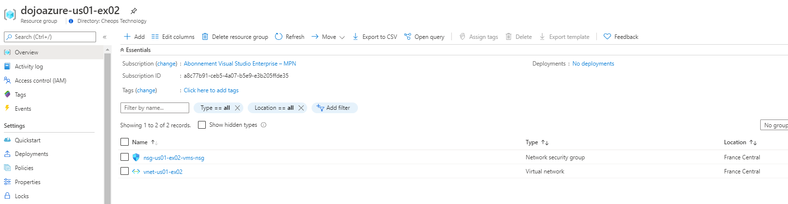
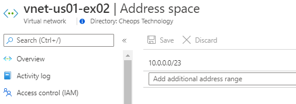
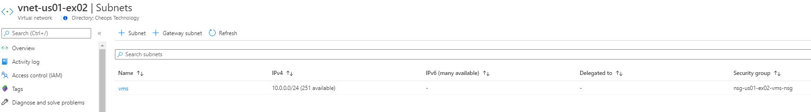
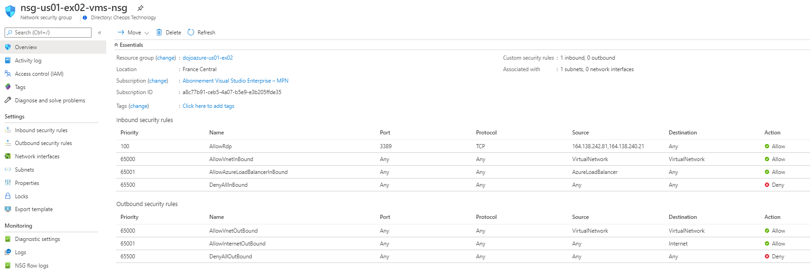
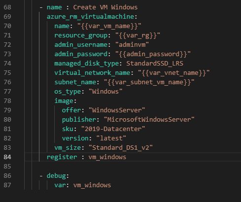
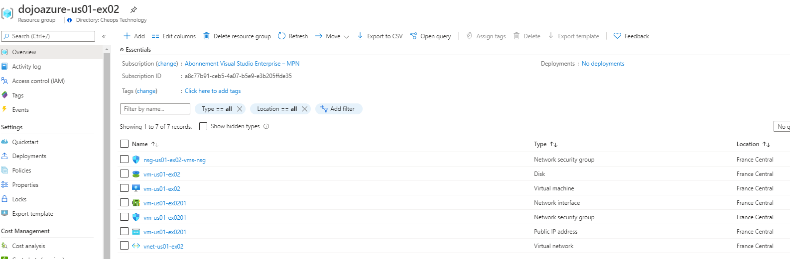

# Exercice 2
## Résumé

Objectif : le but de cet exercice est d'apprendre à manipuler Azure avec Ansible.

Les étapes de cet exercice : 
 - [Etape 1 : Créer une Virtual Machine Azure avec Ansible](.#etape-1---cr%C3%A9er-une-virtual-machine-azure-avec-ansible)
 - [Etape 2 : Configurer IIS sur votre Virtual Machine avec Ansible](.#etape-2---configurer-iis-sur-votre-virtual-machine-avec-ansible)
    
## Pré-requis

- Une souscription Azure sur laquelle vous avez des droits à minima de contribution
  
## Etape 1 - Créer une Virtual Machine Azure avec Ansible
Se connecter au portail Azure : https://portal.azure.com
Utiliser votre compte personnel disposant d'une souscription Azure

Dans cette étape, nous allons utiliser Ansible comme outil d'automatisation. Il peut être installé sur votre poste de travail ou être utilisé directement dans Azure via l'option Cloud Shell du portail Azure, nous utiliserons cette méthode dans l'exercice suivant

Sur le portail Azure, lancer le Cloud Shell  
  

Lors de sa première exécution, un popup va vous signaler que le Cloud Shell n'est pas configuré  
  

Il faut donc le configurer. Pour cela, Azure va créer un Resource Group sur votre souscription avec un Storage Account qui servira à stocker le paramétrage du Cloud Shell. Si il n'y a pas de Cloud Shell existant pour votre souscription, merci de suivre les indications suivantes :
 - Cliquer sur advanced settings
 - Configurer les propriétés  
| Propriétés | Description | Valeur |
| --- | --- | --- |
| Cloud Shell region | Région d'hébergement | Choisir `France Central`
| Resource Group | Groupe de ressources pour votre Cloud Shell | Indiquer `cloudshell`
| Storage account | Utilisé pour sauvegarder les propriétés du CS | Indiquer `cloudshellsaXXXX` (XXXX = chaine de caractères aléatoire)*
| File share | File share qui sera utilisé pour sauvegarder votre espace CS dans le Storage Account | Choisir `cloudshellfs`
*un storage account doit avoir un nom unique dans une région donnée car cela réserve un alias DNS dans Azure qui doit être unique

 - Cliquer sur "create storage"

Une fois le Cloud Shell démarré, vous avez le choix entre une interface bash ou Powershell. Choisissez celle qui vous plait le plus. Cela n'a pas d'incidence sur l'usage d'ansible. Ici l'interface PowerShell
  

> 👀 si vous utilisez Ansible sur votre poste, avant de suivre la suite de l'exercice, utilisez la commande suivante pour vous authentifier sur Azure et utiliser la bonne souscription : `az login` (nécessite az cli sur votre poste)

Configurer ensuite l'environnement de travail Azure à l'aide d'az cli :
 - Lister les souscriptions de votre abonnement : `az account show`
 - Choisir la souscriptions à manipuler : `az account set --subscription "XXXXX"` (où XXXXX = ID de votre souscription récupéré dans le résultat de la commande précédente)

Vous allez maintenant travailler sur ansible à la création d'un playbook permettant de créer une VM sur Azure.
Vous pouvez :
 - soit vous appuyer sur un playbook existant qui créer de base un certain nombre de ressources Azure utiles à l'hébergement de la VM
 - soit vous pouvez créer votre playbook from scrath. A noter qu'il vous faudra créer un Resource Group, un VNET, un subnet et un NSG en pré-requis de la création de la VM

Si vous créez votre playbook, merci de ne pas suivre les indications ci-dessous et de vous reporter à l'étape 2 une fois votre VM créée.

Si vous vous initiez à Ansible, vous pouvez vous appuyer sur le playbook [azure.yml](./azure.yml) existant dans le repo.
Examinons donc ce playbook ansible :
  - Télécharger le fichier azure.yml et éditez le avec l'éditeur de votre choix. Si vous le souhaitez, vous pouvez utiliser l'éditeur situé dans le Cloud Shell Azure en appuyant sur le bouton suivant  une fois le CS démarré. vous pouvez même cloner le repo GitHub pour récupérer le fichier .yml via la commande `git clone https://github.com/mblanquer/azure-automation.git`  
  - Un playbook Ansible permet d'orchestrer des tâches qui seront exécutées sur un ensemble de machines. Se référer à la [documentation suivante](https://docs.ansible.com/ansible/latest/user_guide/playbooks_intro.html) pour en apprendre plus sur les playbooks Ansible
  - La structure du playbook est la suivante :  
    `- hosts: localhost`  
      `vars :`  
      `tasks:`  
        
    | Section | Description |
    | --- | --- |
    | hosts | Défini sur quelle(s) machine(s) seront executées les tâches du playbooks. Ansible va alors regarder dans "l'inventory" configuré pour voir quelles sont les machines liées à la valeur renseignée dans ce paramètre "hosts". Dans notre cas, pour créer les ressources Azure, nous le faisons depuis notre machine / Cloud Shell donc nous l'avons défini à `localhost` 
    | vars | Défini les variables qui seront utilisées dans le playbook
    | tasks | Défini les tâches qui seront exécutées dans ce playbook

  - Zoom sur la section "vars" de ce playbook :  

    | Variable | Description | Valeur | 
    | --- | --- | --- |
    | var_rg | Nom du Resource Group à créer | `"dojoazure-{{user_id}}-ex02"` A noter qu'on utilise `{{user_id}}` pour faire référence à une autre variable. Ici `user_id` qui correspondra à l'id utilisateur (ex : us01), variable qui sera transmise à l'exécution du playbook
    | var_location | Région Azure utilisée | `francecentral` qui fait référence à la Région France Central
    | var_vnet_name | Nom du vnet à créer | `"vnet-{{user_id}}-ex02"`
    | var_subnet_vm_name | Nom du subnet qui sera créé pour la VM | `"vms"` Ce subnet sera créé dans le vnet
    | var_nsg_vm_name | Nom du Network Security Group (NSG) créé pour protéger le subnet | `"nsg-{{user_id}}-ex02-vms-nsg"` Ce NSG sera associé au subnet vms et protégera ce dernier au travers de règles de filtrage réseau
    | var_tags | Tags à appliquer sur les ressources | `project: dojoazure user: us01 exercice: ex02`  
      
    - Zoom sur la section "tasks" de ce playbook :  

    | Task | Description | 
    | --- | --- | 
    | Create resource group | Tâche de création du Resource Group (RG) dans lequel seront créés les ressources Azure. S'appuie sur le module ansible "azure_rm_resourcegroup" auquel sont passés différents paramètres : name (nom du RG) et location (région pour ce RG)
    | Create Vnet | Tâche de création du VNET sur lequel sera hébergé la VM. S'appuie sur le module ansible "azure_rm_virtualnetwork" auquel sont passés différents paramètres : name (nom du vnet), resource_group (RG du vnet), address_prefixes_cidr (CIDRs du vnet), tags (tags pour ce vnet)
    | Create NSG for VMs subnet | Tâche de création d'un Network Security Goup (NSG) qui permettra de définir des règles firewall à appliquer. Cela peut être fait sur un subnet ou directement sur une NIC (Network Interface) d'une VM. S'appuie sur le module ansible "azure_rm_securitygroup" auqeul sont passés différents paramètres : name (nom du NSG), resource_group (RG du NSG), purge_rules (permet de préciser à Ansible de purger les règles existantes avant application des nouvelles), rules (règles firewall à appliquer avec différents paramètres décrits [ici](https://docs.ansible.com/ansible/latest/modules/azure_rm_securitygroup_module.html))
    | Create VMs subnet | Tâche de création du subnet qui hébergera la VM. s'appuie sur le module ansible "azure_rm_subnet" auquel sont passés différents paramètres : name (nom du subnet), resource_group (RG du subnet), virtual_network_name (VNET du subnet), address_prefix_cidr (CIDR du subnet), security_group (NSG du subnet)  
      
    A noter l'usage de :
     - register : permet d'enregistrer dans une variable le résultat de la tâche
     - debug : tâche qui permet d'écrire dans la console. Dans ce playbook, utilisé pour écrire le résultat des tâches via la variable alimentée par le "register" des tâches de création de ressources

Une fois la structure et le contenu du playbook en tête, voici la commande à exécuter pour l'exécuter :  
`ansible-playbook azure.yml --extra-vars "user_id=usXX"` (où usXX = id utilisateur, valeur transmise à la variable `user_id` utilisée pour définir les noms des ressouces Azure)  

Cela va donc créer les ressources dans Azure, de la sorte :  
  
  
  
  

> 📘 Ce playbook vous a permis de créer les pré-requis à la création de votre Virtual Machine

 Ajoutons maintenant une virtual machine Windows à ce playbook :
  - Dans la section "vars", ajouter la variable suivante qui correspondra au nom de la Virtual Machine :  
        `var_vm_name: "vm-{{user_id}}-ex02"`  
  - Dans la section "tasks", ajouter ensuite le bloc suivant pour la création de la Virtual Machine :  
        `- name : Create VM Windows`  
          `azure_rm_virtualmachine:`  
            `name: "{{var_vm_name}}"`  
            `resource_group: "{{var_rg}}"`  
            `admin_username: "adminvm"`  
            `admin_password: "{{admin_password}}"`  
            `managed_disk_type: StandardSSD_LRS`  
            `virtual_network_name: "{{var_vnet_name}}"`  
            `subnet_name: "{{var_subnet_vm_name}}"`  
            `os_type: "Windows"`  
            `image:`  
                `offer: "WindowsServer"`  
                `publisher: "MicrosoftWindowsServer"`  
                `sku: "2019-Datacenter"`  
                `version: "latest"`  
            `vm_size: "Standard_DS1_v2"`  
          `register : vm_windows`  

    Quelques explications autour du module "azure_rm_virtualmachine" [doc ici](https://docs.ansible.com/ansible/latest/modules/azure_rm_virtualmachine_module.html) :
    | Paramètre | Description | Valeur |
    | --- | --- | --- |
    | name | Nom de la VM à créer | Ici `"{{var_vm_name}}"` qui correspond à la variable définie précédemment
    | resource_group | Nom du RG dans lequel créer la VM | Ici `"{{var_rg}}"`, variable définie en début de playbook
    | admin_username | Compte admin créé sur la VM | Ici `"adminvm"`, défini arbitrairement
    | admin_password | Mot de passe du compte admin | ici boolean `"{{admin_password}}"`, variable non définie dans le playbook donc à transmettre lors de son exécution
    | managed_disk_type | Utilisation d'un managed disk Azure | Ici `StandardSSD_LRS` qui indique l'usage d'un disque SSD en Locally Redundant Storage donc dupliqué 3 fois à l'échelle d'un Datacenter Azure. Pas de réplication zones ni région
    | virtual_network_name | VNET dans lequel créer la VM | Ici `"{{var_vnet_name}}"` qui fait référence au vnet précédemment créé via la variable associée  
    | subnet_name | Subnet dans lequel crééer la VM | Ici `"{{var_subnet_vm_name}}"` qui fait référence au subnet "vms" précédemment créé via la variable associée 
    | os_type | Précise l'OS à utiliser pour cette VM | Ici `Windows`
    | image | Précise l'image de VM à utiliser pour la création de cette VM | Ici est utilisé une VM de type Datacenter en WS 2019 dans la dernière version proposée au catalogue par Microsoft  
    | vm_size | Taille de la VM (cpu, RAM) | Ici `Standard_DS1_v2` qui correspond à une VM d'usage générale (répartition équitable entre CPU et RAM) avec 1 vCPU et 3,5 Go de RAM et stockage temporaire de 7 Go (cf. [doc de référence](https://docs.microsoft.com/fr-fr/azure/virtual-machines/sizes))
  - Toujours dans la sections "tasks", ajouter le bloc suivant pour visualiser le résultat de la création de la VM (variable vm_windows du paramètre register de la tâche de création de VM) :  
        `- debug:`  
            `var: vm_windows` 
  - Bien faire l'indentation du fichier :  
     
    

  Rexécuter votre template :
 - Aller dans le cloud shell 
 - Lancer la commande suivante :  
`ansible-playbook azure.yml --extra-vars "user_id=usXX admin_password=YYYY"` où  
    - usXX = id utilisateur, valeur transmise à la variable `user_id` utilisée pour définir les noms des ressouces Azure
    - admin_password = le password du compte admin de la machine "admincheops". Choisir le mot de passe de votre choix
 - Vous devriez voir votre Virtual Machine créée dans le Resource Group :
  

Le playbook correspondant aux ajouts effectués ci-dessous est [azure_vm.yml](./azure_vm.yml)

> 👏 Bravo, votre Virtual Machine est créée via un playbook Ansible !  
 
## Etape 2 : Configurer IIS sur votre Virtual Machine avec Ansible  

Work in progress  

## Supprimer les ressources 

En fin d'exercice, vous pouvez supprimer les ressources utilisées pendant l'exercice pour éviter une consommation inutile de crédits Azure.

Voici la commande à utiliser :
`Remove-AzResourceGroup -Name "dojoazure-usXX-ex02"` où usXX = user id
 
----------------------------------------------------------------------------------------------------------------
Au travers de cet exercice, vous avez appris à :
 - vous familiarisez avec Azure
 - à manipuler des ressources Azure via Ansible  